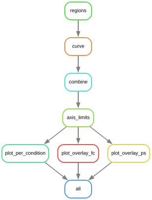
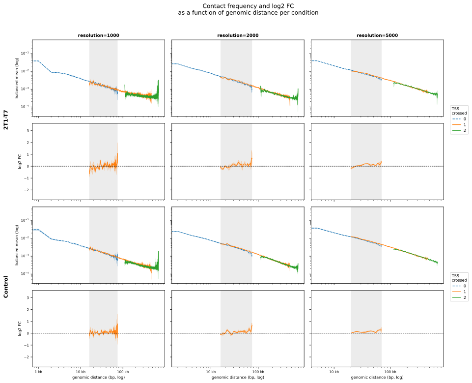
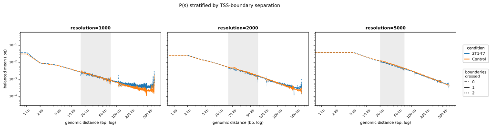
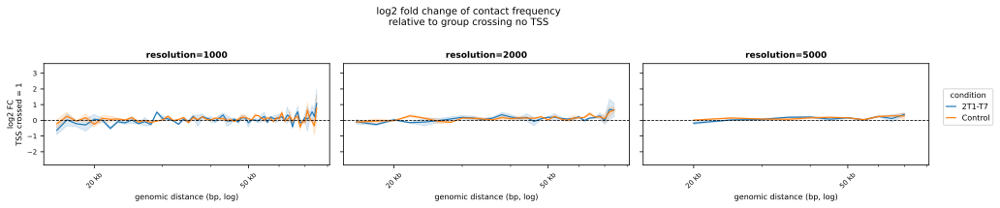

# Distance-dependent decay stratified by the number of PTU boundaries separating each locus pair

Distance-dependent Hi-C contact frequency decay **(P(s))**, **stratified by the number of PTU boundaries separating each locus pair**, 
computed across multiple conditions with **uncertainty estimated from biological replicates**.

For each intra-chromosomal contact, the pipeline counts how many TSS/PTU
boundaries lie between the two loci and groups contacts by that count. It then
measures how contact frequency decays with genomic distance *within* each group,
and how that decay differs between experimental conditions — **a readout of
boundary insulation strength**.

This module sits **downstream of multi-resolution cool files (mcool files)** 
that had been processed according to the distiller pipeline (v.0.3.4; https://github.com/mirnylab/distiller-nf) 
described in [Rabuffo et al. 2024](https://doi.org/10.1038/s41467-024-55285-9), 
where the *T. brucei* Hi-C mapped reads were corrected for ploidy and then 
aggregated into contact matrices in the cooler format (cool files) using the cooler package 
(v0.10.4; https://github.com/open2c/cooler) at 1 kb and into mcool files (resolutions: 1 kb, 2 kb, 5 kb, 10 kb). 
It consumes the balanced `.mcool` files and a ploidy-corrected *T. brucei* TSS/PTU-boundary annotation in BED format as input.  
Balanced cis pixels are read **straight from the `.mcool`** through the cooler Python API — one chromosome
submatrix at a time, with no genome-wide text dump — and reduced to a per-replicate curve
(mean and standard error per `(group, distance)` bin; the SE of the mean is equivalent to the
[Welford 1962](https://doi.org/10.2307/1266577) corrected-sums formulation).
The pipeline then takes the mean and SE *across replicate means*.


---

## Workflow




| Rule | Tool | Description |
|------|------|--------------|
| `regions` | `make_regions.py` | TSS/PTU BED → generate inter-boundary regions (`regions.json`), one per TSS set |
| `curve` | `replicate_curve.py` | balanced cis pixels read directly from one `.mcool` (cooler Python API) → per-replicate P(s) curve, stratified by boundary crossings |
| `combine` | `combine_condition.py` | a condition's replicates → mean/SE + log2 fold change tables |
| `axis_limits` | `axis_limits.py` | pool every condition/TSS set for shared y-axis limits (`axis_limits.json`) |
| `plot_per_condition` | `plot_per_condition.py` | rows = condition, cols = resolution |
| `plot_overlay_fc` | `plot_overlay_fc.py` | log2 fold change with conditions overlaid, faceted by boundary group |
| `plot_overlay_ps` | `plot_overlay_ps.py` | balanced-mean P(s) with conditions overlaid, boundary groups distinguished by line style |

Every output is namespaced by a TSS-set tag (`{tss}`), so the pipeline builds a
full result set — including all three figures — per entry in `tss_beds`.

---

## Layout


```
Ps_stratified/
├── README.md
├── LICENSE                     
├── CITATION.cff                
├── .gitignore
├── config/
│   ├── config.yaml             
│   └── README.md               
├── workflow/
│   ├── Snakefile               
│   ├── modules.py              
│   ├── scripts/                
│   │   ├── make_regions.py
│   │   ├── replicate_curve.py
│   │   ├── combine_condition.py
│   │   ├── axis_limits.py
│   │   ├── plot_per_condition.py
│   │   ├── plot_overlay_fc.py
│   │   └── plot_overlay_ps.py
│   └── envs/
│       └── environment.yaml    
├── resources/
│   ├── bed_files/                # TSS/PTU-boundary BEDs (tss_beds)
│   │   └── *.bed
│   └── mcool_files/              # balanced .mcool inputs
│       └── *.mcool
├── docs/                       
└── results/                    
```

---

## Configuration

Edit [config/config.yaml](config/config.yaml); every field is documented in
[config/README.md](config/README.md).

**Paths** - `mcool_dir` (default `resources/mcool_files`), `results_dir`,
  `tss_beds` (BEDs under `resources/bed_files/`) — all relative to the repo root;
  edit `mcool_dir`/`tss_beds` to point at your data when cloning standalone.
  - **`tss_beds`** — a map of `{tag: bed_path}`. Each tag namespaces a full result
  set (curves, tables, all three figures), so multiple TSS/PTU-boundary sets are
  processed in one run. (A single `tss_bed` key is still accepted.)
  - **`resolutions`** — one or more bin sizes; each must exist as a zoom level in
  the `.mcool` files.

<br>

**Analysis parameters** 

- `extend` (`0` = raw boundaries, `>0` = clamped overlap-free extension in bp)
- `min_regions` (drop chromosomes with fewer inter-TSS regions)
- `max_group` (crossings above this collapse into `">N"`;
  `null` = no collapse)
- `ref_group` (fold-change reference, `"0"` = within-region contacts).

<br>

**Conditions** — maps each condition to its `{replicate: mcool_filename}`.
  Filenames are given explicitly because the source files may **not be named uniformly**.

---

## Running

Run all commands from the **repository root** (Snakemake auto-discovers
`workflow/Snakefile`):

```bash
# clone the repository
git clone https://github.com/seupark/Ps_stratified.git
cd Ps_stratified

# one-time: create the pinned environment
conda env create -f workflow/envs/environment.yaml
conda activate ps_stratified

# dry run / DAG check
snakemake -n

# run
snakemake --cores 8             
```

Targets (`rule all`) — three SVG figures per TSS-set tag (`{tss}`):

- `results/plots/per_condition_{tss}.svg`
- `results/plots/overlay_fc_{tss}.svg`
- `results/plots/overlay_ps_{tss}.svg`

---

## Example outputs

Figures below are from the `chr11_sTSS1_sTSS4` TSS set (two conditions,
two biological replicates each).

**Per-condition P(s)** — rows = condition, cols = resolution; boundary groups
overlaid within each panel.



**Overlaid P(s)** — balanced-mean P(s) with conditions overlaid, boundary groups
distinguished by line style.



**Overlaid log2 fold change** — log2 fold change with conditions overlaid,
faceted by boundary group.



---

## References

1. Rabuffo, C., Schmidt, M. R., Yadav, P., Tong, P., Carloni, R., Barcons-Simon, A., Cosentino, R. O., Krebs, S., Matthews, K. R., Allshire, R. C., & Siegel, T. N. (2024). Inter-chromosomal transcription hubs shape the 3D genome architecture of African trypanosomes. *Nature Communications*, *15*, Article 10323. https://doi.org/10.1038/s41467-024-55285-9

2. Welford, B. P. (1962). Note on a method for calculating corrected sums of squares and products. *Technometrics*, *4*(3), 419–420. https://doi.org/10.2307/1266577
